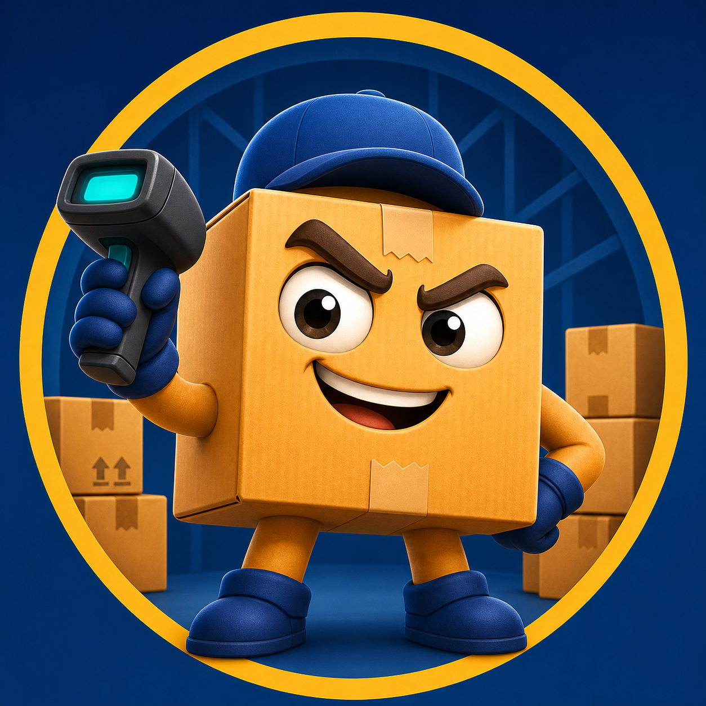

# StockKeeper

<p align="center">
  
</p>

<p align="center">
  A private, offline-first Android inventory manager for products, stock movements, customers, manufacturers, and storage locations.
</p>

## Overview

StockKeeper is a lightweight warehouse application designed for small teams and personal inventory management. All operational data is stored locally on the Android device with Room and remains available without an internet connection.

## Features

- Create, edit, archive, and restore products.
- Attach product photos from the camera or gallery.
- Track receipts, sales, and write-offs.
- Calculate current stock from the complete movement history.
- Maintain manufacturer, customer, rack, and shelf directories.
- Search by product name, article, or manufacturer.
- Filter the warehouse by manufacturer, availability, rack, and shelf.
- Choose which warehouse filters are visible.
- View product-specific and global movement history.
- Export and import a ZIP backup containing the database and product photos.
- Use English or Ukrainian with light, dark, or system appearance.

## Technology

- Kotlin
- Android SDK 24+ (Android 7.0 or newer)
- Room / SQLite
- Kotlin Coroutines and Flow
- Material Design 3
- Gradle Kotlin DSL and KSP

The application is offline-first and does not request internet access. The camera permission is requested only when taking a product photo.

## Download and install

### Install a provided APK

1. Download the APK to the Android device.
2. Open the file from the browser, file manager, email, or messenger.
3. If Android asks for permission, allow that application to install unknown apps.
4. Tap **Install**.

Only install APK files received from a trusted source. A release intended for distribution should be signed with a private release key.

### Update without losing data

Install the newer APK over the existing application and choose **Update**. Products, history, settings, and photos remain on the device when:

- the package ID stays `com.example.stockkeeper`;
- the new APK is signed with the same key as the installed APK;
- the new version is not older than the installed version;
- the existing application is not uninstalled first.

Create a backup from **Settings → Backup and transfer → Export backup** before every important update. Uninstalling the application removes its local data.

## Build from source

### Requirements

- Android Studio with support for Android Gradle Plugin 9.3.1
- Android SDK 37
- JDK 11 or newer supported by the configured Android Gradle Plugin
- Git

### Android Studio

1. Clone the repository:

   ```bash
   git clone https://github.com/ATarasovHub/StockKeeper.git
   cd StockKeeper
   ```

2. Open the project directory in Android Studio.
3. Allow Gradle to synchronize and install any missing Android SDK components.
4. Select an emulator or a connected Android device.
5. Click **Run**.

### Command line

On Windows:

```powershell
.\gradlew.bat test
.\gradlew.bat assembleDebug
```

On macOS or Linux:

```bash
./gradlew test
./gradlew assembleDebug
```

The debug APK is generated at:

```text
app/build/outputs/apk/debug/app-debug.apk
```

Debug APKs built on different computers normally use different signing keys and cannot update one another. Use one stable release keystore for APKs distributed to other people.

## Backups

The backup feature creates a ZIP archive containing:

- the Room database;
- product photos;
- a format and database version manifest.

To transfer data to another device, export a backup on the original device, install StockKeeper on the new device, and import the ZIP from the settings screen. Import replaces current application data, so keep the original backup until the restored data has been verified.

## Project structure

```text
app/src/main/java/com/example/stockkeeper/
├── data/
│   ├── backup/       Backup import and export
│   ├── local/        Room database, entities, and DAOs
│   ├── photo/        Private product-photo storage
│   └── repository/   Inventory business operations
├── search/           Recent search history
├── settings/         Persistent application settings
└── ui/               Warehouse, product, history, directories, and settings screens
```

## Data and privacy

StockKeeper does not require an account and does not send inventory data to a server. The database and product photos are stored in the application's private internal storage. Exported backup files are not encrypted by StockKeeper; store and share them carefully because they may contain commercially sensitive information and customer details.

## Verification

Run the automated checks before publishing a build:

```powershell
.\gradlew.bat test
.\gradlew.bat lint
.\gradlew.bat assembleDebug
```

For release distribution, increment `versionCode` and `versionName`, configure release signing outside version control, and test an in-place update on a device containing a recent backup.

## Status

StockKeeper is under active development. Database schema changes should include tested Room migrations before a new APK is distributed.
